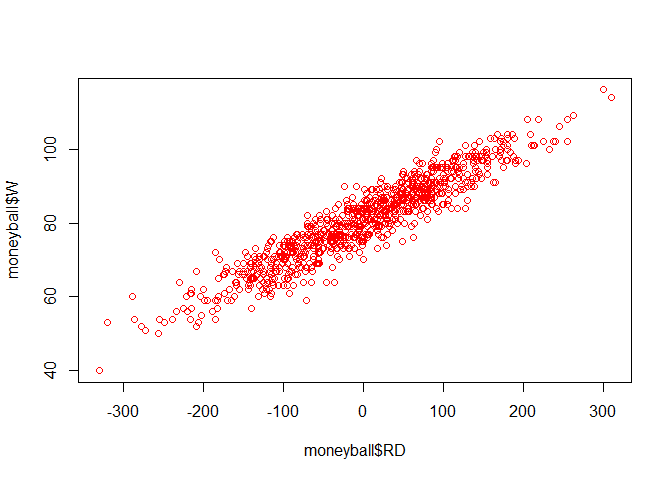

Moneyball-Prediction
================
Niket

``` r
# Read in data
baseball <- read.csv("baseball.csv", header = TRUE)
str(baseball)
```

    ## 'data.frame':    1232 obs. of  15 variables:
    ##  $ Team        : Factor w/ 39 levels "ANA","ARI","ATL",..: 2 3 4 5 7 8 9 10 11 12 ...
    ##  $ League      : Factor w/ 2 levels "AL","NL": 2 2 1 1 2 1 2 1 2 1 ...
    ##  $ Year        : int  2012 2012 2012 2012 2012 2012 2012 2012 2012 2012 ...
    ##  $ RS          : int  734 700 712 734 613 748 669 667 758 726 ...
    ##  $ RA          : int  688 600 705 806 759 676 588 845 890 670 ...
    ##  $ W           : int  81 94 93 69 61 85 97 68 64 88 ...
    ##  $ OBP         : num  0.328 0.32 0.311 0.315 0.302 0.318 0.315 0.324 0.33 0.335 ...
    ##  $ SLG         : num  0.418 0.389 0.417 0.415 0.378 0.422 0.411 0.381 0.436 0.422 ...
    ##  $ BA          : num  0.259 0.247 0.247 0.26 0.24 0.255 0.251 0.251 0.274 0.268 ...
    ##  $ Playoffs    : int  0 1 1 0 0 0 1 0 0 1 ...
    ##  $ RankSeason  : int  NA 4 5 NA NA NA 2 NA NA 6 ...
    ##  $ RankPlayoffs: int  NA 5 4 NA NA NA 4 NA NA 2 ...
    ##  $ G           : int  162 162 162 162 162 162 162 162 162 162 ...
    ##  $ OOBP        : num  0.317 0.306 0.315 0.331 0.335 0.319 0.305 0.336 0.357 0.314 ...
    ##  $ OSLG        : num  0.415 0.378 0.403 0.428 0.424 0.405 0.39 0.43 0.47 0.402 ...

``` r
# Observation for every team and year pair from 1962 to 2012 for all seasons with 162 games
```

``` r
# As we are looking at moneyball, so we Subset to only include moneyball years beafore 2002
moneyball <- subset(baseball, Year < 2002) # for year less than 2002
str(moneyball)
```

    ## 'data.frame':    902 obs. of  15 variables:
    ##  $ Team        : Factor w/ 39 levels "ANA","ARI","ATL",..: 1 2 3 4 5 7 8 9 10 11 ...
    ##  $ League      : Factor w/ 2 levels "AL","NL": 1 2 2 1 1 2 1 2 1 2 ...
    ##  $ Year        : int  2001 2001 2001 2001 2001 2001 2001 2001 2001 2001 ...
    ##  $ RS          : int  691 818 729 687 772 777 798 735 897 923 ...
    ##  $ RA          : int  730 677 643 829 745 701 795 850 821 906 ...
    ##  $ W           : int  75 92 88 63 82 88 83 66 91 73 ...
    ##  $ OBP         : num  0.327 0.341 0.324 0.319 0.334 0.336 0.334 0.324 0.35 0.354 ...
    ##  $ SLG         : num  0.405 0.442 0.412 0.38 0.439 0.43 0.451 0.419 0.458 0.483 ...
    ##  $ BA          : num  0.261 0.267 0.26 0.248 0.266 0.261 0.268 0.262 0.278 0.292 ...
    ##  $ Playoffs    : int  0 1 1 0 0 0 0 0 1 0 ...
    ##  $ RankSeason  : int  NA 5 7 NA NA NA NA NA 6 NA ...
    ##  $ RankPlayoffs: int  NA 1 3 NA NA NA NA NA 4 NA ...
    ##  $ G           : int  162 162 162 162 161 162 162 162 162 162 ...
    ##  $ OOBP        : num  0.331 0.311 0.314 0.337 0.329 0.321 0.334 0.341 0.341 0.35 ...
    ##  $ OSLG        : num  0.412 0.404 0.384 0.439 0.393 0.398 0.427 0.455 0.417 0.48 ...

``` r
# we need to look at Run Scored and Run Allowed
# Compute Run Difference
moneyball$RD <- moneyball$RS - moneyball$RA
str(moneyball)
```

    ## 'data.frame':    902 obs. of  16 variables:
    ##  $ Team        : Factor w/ 39 levels "ANA","ARI","ATL",..: 1 2 3 4 5 7 8 9 10 11 ...
    ##  $ League      : Factor w/ 2 levels "AL","NL": 1 2 2 1 1 2 1 2 1 2 ...
    ##  $ Year        : int  2001 2001 2001 2001 2001 2001 2001 2001 2001 2001 ...
    ##  $ RS          : int  691 818 729 687 772 777 798 735 897 923 ...
    ##  $ RA          : int  730 677 643 829 745 701 795 850 821 906 ...
    ##  $ W           : int  75 92 88 63 82 88 83 66 91 73 ...
    ##  $ OBP         : num  0.327 0.341 0.324 0.319 0.334 0.336 0.334 0.324 0.35 0.354 ...
    ##  $ SLG         : num  0.405 0.442 0.412 0.38 0.439 0.43 0.451 0.419 0.458 0.483 ...
    ##  $ BA          : num  0.261 0.267 0.26 0.248 0.266 0.261 0.268 0.262 0.278 0.292 ...
    ##  $ Playoffs    : int  0 1 1 0 0 0 0 0 1 0 ...
    ##  $ RankSeason  : int  NA 5 7 NA NA NA NA NA 6 NA ...
    ##  $ RankPlayoffs: int  NA 1 3 NA NA NA NA NA 4 NA ...
    ##  $ G           : int  162 162 162 162 161 162 162 162 162 162 ...
    ##  $ OOBP        : num  0.331 0.311 0.314 0.337 0.329 0.321 0.334 0.341 0.341 0.35 ...
    ##  $ OSLG        : num  0.412 0.404 0.384 0.439 0.393 0.398 0.427 0.455 0.417 0.48 ...
    ##  $ RD          : int  -39 141 86 -142 27 76 3 -115 76 17 ...

``` r
# let's see whether there is a linear relationship between Run Difference and Wins
# Scatterplot to check for linear relationship
plot(moneyball$RD, moneyball$W, col = "red")
```



``` r
# a very strong relationship can be seen
```

``` r
# Regression model to predict wins using independent variable RD
WinsReg <- lm(W ~ RD, data = moneyball)
summary(WinsReg)
```

    ## 
    ## Call:
    ## lm(formula = W ~ RD, data = moneyball)
    ## 
    ## Residuals:
    ##      Min       1Q   Median       3Q      Max 
    ## -14.2662  -2.6509   0.1234   2.9364  11.6570 
    ## 
    ## Coefficients:
    ##              Estimate Std. Error t value Pr(>|t|)    
    ## (Intercept) 80.881375   0.131157  616.67   <2e-16 ***
    ## RD           0.105766   0.001297   81.55   <2e-16 ***
    ## ---
    ## Signif. codes:  0 '***' 0.001 '**' 0.01 '*' 0.05 '.' 0.1 ' ' 1
    ## 
    ## Residual standard error: 3.939 on 900 degrees of freedom
    ## Multiple R-squared:  0.8808, Adjusted R-squared:  0.8807 
    ## F-statistic:  6651 on 1 and 900 DF,  p-value: < 2.2e-16

``` r
# RD is very significant with 3 stars and R-Squared is 0.88 which is strong model
```

``` r
# moneyball claimed that team needs to score atleast 135 runs more than they allow to win atleast 95 games
# Our coefficient table tells that the regression equation is
# Wins(W) = Intercept(80.8814) + Coefficient for Run Difference(0.1058(RD))
# we want W >= 95 so that A's make it to playoffs
# this is true iff our regression equation is greater than or equal to 95
# we want 80.8814 + 0.1058(RD) >= 95
# RD >= 133.4
# so this 133.4 is very close to the prediction made by moneyball of 135 runs
# so the claim is verified
```

``` r
str(moneyball)
```

    ## 'data.frame':    902 obs. of  16 variables:
    ##  $ Team        : Factor w/ 39 levels "ANA","ARI","ATL",..: 1 2 3 4 5 7 8 9 10 11 ...
    ##  $ League      : Factor w/ 2 levels "AL","NL": 1 2 2 1 1 2 1 2 1 2 ...
    ##  $ Year        : int  2001 2001 2001 2001 2001 2001 2001 2001 2001 2001 ...
    ##  $ RS          : int  691 818 729 687 772 777 798 735 897 923 ...
    ##  $ RA          : int  730 677 643 829 745 701 795 850 821 906 ...
    ##  $ W           : int  75 92 88 63 82 88 83 66 91 73 ...
    ##  $ OBP         : num  0.327 0.341 0.324 0.319 0.334 0.336 0.334 0.324 0.35 0.354 ...
    ##  $ SLG         : num  0.405 0.442 0.412 0.38 0.439 0.43 0.451 0.419 0.458 0.483 ...
    ##  $ BA          : num  0.261 0.267 0.26 0.248 0.266 0.261 0.268 0.262 0.278 0.292 ...
    ##  $ Playoffs    : int  0 1 1 0 0 0 0 0 1 0 ...
    ##  $ RankSeason  : int  NA 5 7 NA NA NA NA NA 6 NA ...
    ##  $ RankPlayoffs: int  NA 1 3 NA NA NA NA NA 4 NA ...
    ##  $ G           : int  162 162 162 162 161 162 162 162 162 162 ...
    ##  $ OOBP        : num  0.331 0.311 0.314 0.337 0.329 0.321 0.334 0.341 0.341 0.35 ...
    ##  $ OSLG        : num  0.412 0.404 0.384 0.439 0.393 0.398 0.427 0.455 0.417 0.48 ...
    ##  $ RD          : int  -39 141 86 -142 27 76 3 -115 76 17 ...

``` r
# Regression model to predict runs scored on three variables
RunsReg <- lm(RS ~ OBP + SLG + BA, data = moneyball)
summary(RunsReg)
```

    ## 
    ## Call:
    ## lm(formula = RS ~ OBP + SLG + BA, data = moneyball)
    ## 
    ## Residuals:
    ##     Min      1Q  Median      3Q     Max 
    ## -70.941 -17.247  -0.621  16.754  90.998 
    ## 
    ## Coefficients:
    ##             Estimate Std. Error t value Pr(>|t|)    
    ## (Intercept)  -788.46      19.70 -40.029  < 2e-16 ***
    ## OBP          2917.42     110.47  26.410  < 2e-16 ***
    ## SLG          1637.93      45.99  35.612  < 2e-16 ***
    ## BA           -368.97     130.58  -2.826  0.00482 ** 
    ## ---
    ## Signif. codes:  0 '***' 0.001 '**' 0.01 '*' 0.05 '.' 0.1 ' ' 1
    ## 
    ## Residual standard error: 24.69 on 898 degrees of freedom
    ## Multiple R-squared:  0.9302, Adjusted R-squared:   0.93 
    ## F-statistic:  3989 on 3 and 898 DF,  p-value: < 2.2e-16

``` r
# All variables are significant and R-Squared is 0.93
# but coefficient for batting avg. is -ve,
# => when all else being equal a team with loweer batting average will score more runs which is counterintuitive,
# this is due to multicollinearity, as these 3 hitting statistics are highly correlated, 

# lets remove batting avg, BA, variable with least significance
RunsReg <- lm(RS ~ OBP + SLG, data = moneyball)
summary(RunsReg)
```

    ## 
    ## Call:
    ## lm(formula = RS ~ OBP + SLG, data = moneyball)
    ## 
    ## Residuals:
    ##     Min      1Q  Median      3Q     Max 
    ## -70.838 -17.174  -1.108  16.770  90.036 
    ## 
    ## Coefficients:
    ##             Estimate Std. Error t value Pr(>|t|)    
    ## (Intercept)  -804.63      18.92  -42.53   <2e-16 ***
    ## OBP          2737.77      90.68   30.19   <2e-16 ***
    ## SLG          1584.91      42.16   37.60   <2e-16 ***
    ## ---
    ## Signif. codes:  0 '***' 0.001 '**' 0.01 '*' 0.05 '.' 0.1 ' ' 1
    ## 
    ## Residual standard error: 24.79 on 899 degrees of freedom
    ## Multiple R-squared:  0.9296, Adjusted R-squared:  0.9294 
    ## F-statistic:  5934 on 2 and 899 DF,  p-value: < 2.2e-16

``` r
# our independent variables are still significant and our R-Squared is 0.93, and coefficients are +ve
# OBP has larger coefficient tha SLG, these variables are on same scale, so OBP is probably worth more than SLG,
# so we can say that BA is overvalued, OBP is most important, and SLG is important for predicting run scored RS.
```

``` r
# Predict Runs and Wins for 2002 Oakland A's
# we use 2001 team statistics for 2002 performance

# Predicting Runs Scored
# Team OBP is 0.339
# Team SLG is 0.430

# our regression equation
# RS = -804.63 + 2737.77(OBP) + 1584.91(SLG)
# After putting the values we get 
# RS = 805

# Predicting Runs Allowed
# Team OOBP is 0.307
# team OSLG is 0.373

# our regression equation
# RA = -873.38 + 2913.60(OOBP) + 1514.29(OSLG)
# After putting the values we get 
# RA = 622 

# Regression equation to predict wins is
# Wins = 80.8814 + 0.1058(RS - RA)
# Prediction for WIn = 100 

# our prediction vs real prediction vs Actual
# RS    805           800-820           800
# RA    622           650-670           653
# Wins  100            93-97            103

# our prediction is very close to actual result for playoffs

# here we can't predict wins in World Series as sample size is too small,
# for that we can we use logistic regression
```
