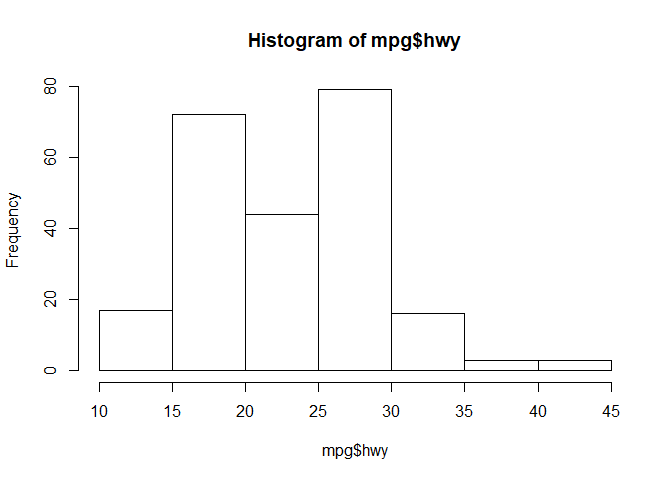
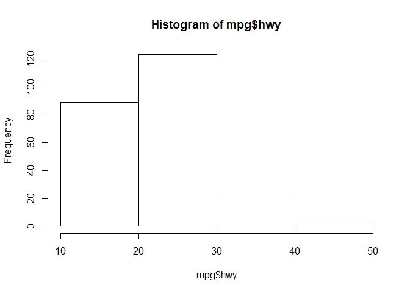
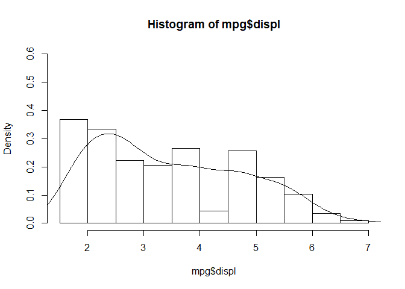
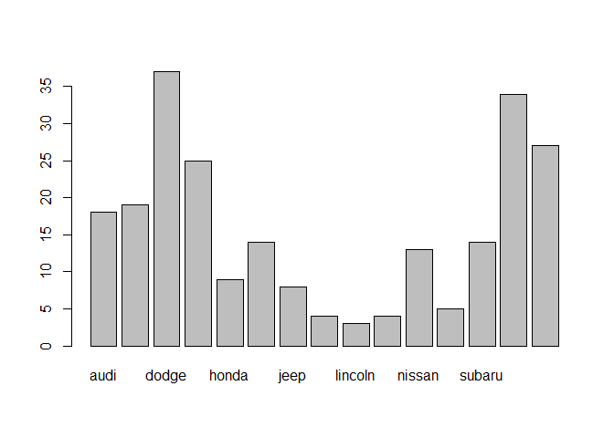
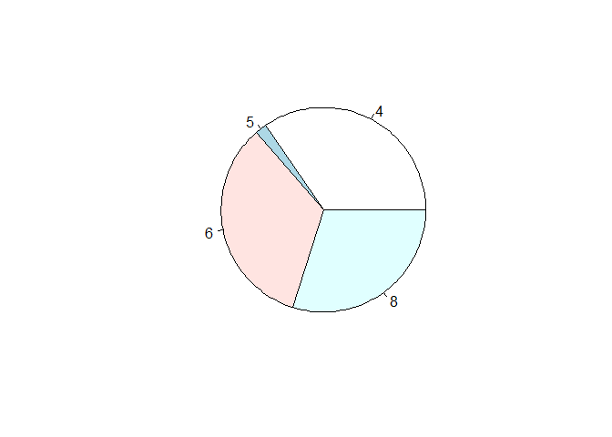
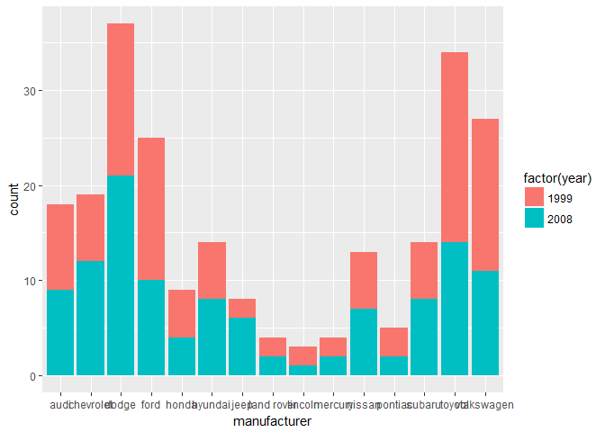
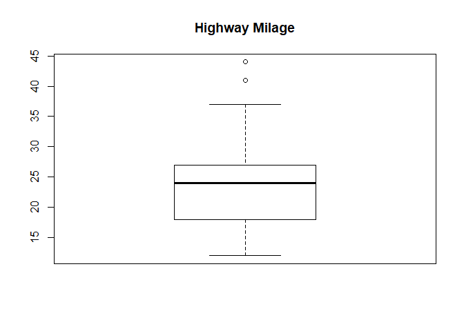
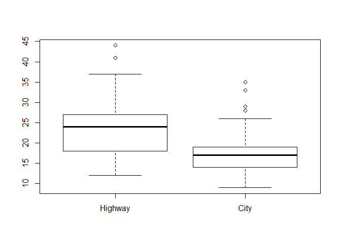
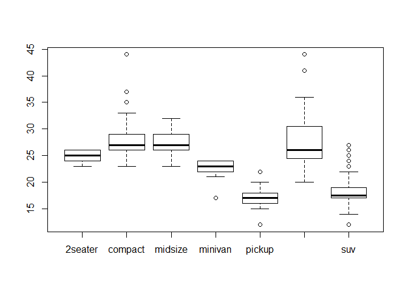

mpg\_Dataset
================
Niket

``` r
# install.packages('ggplot2')
require("ggplot2")
```

    ## Loading required package: ggplot2

``` r
head(mpg)
```

    ## # A tibble: 6 x 11
    ##   manufacturer model displ  year   cyl      trans   drv   cty   hwy    fl
    ##          <chr> <chr> <dbl> <int> <int>      <chr> <chr> <int> <int> <chr>
    ## 1         audi    a4   1.8  1999     4   auto(l5)     f    18    29     p
    ## 2         audi    a4   1.8  1999     4 manual(m5)     f    21    29     p
    ## 3         audi    a4   2.0  2008     4 manual(m6)     f    20    31     p
    ## 4         audi    a4   2.0  2008     4   auto(av)     f    21    30     p
    ## 5         audi    a4   2.8  1999     6   auto(l5)     f    16    26     p
    ## 6         audi    a4   2.8  1999     6 manual(m5)     f    18    26     p
    ## # ... with 1 more variables: class <chr>

------------------------------------------------------------------------

**Measures of Central Tendancy**

``` r
mean(mpg$hwy) # Average
```

    ## [1] 23.44017

``` r
median(mpg$hwy) #Median
```

    ## [1] 24

``` r
quantile(mpg$hwy) # quartile
```

    ##   0%  25%  50%  75% 100% 
    ##   12   18   24   27   44

``` r
max(mpg$hwy)
```

    ## [1] 44

``` r
quantile(mpg$hwy, 0.9) # Percentile
```

    ## 90% 
    ##  30

``` r
quantile(mpg$hwy, c(0.1, 0.2, 0.3, 0.4, 0.5))
```

    ##  10%  20%  30%  40%  50% 
    ## 16.3 17.0 19.0 22.0 24.0

------------------------------------------------------------------------

**Measures of Spread**

``` r
range(mpg$hwy) # Range
```

    ## [1] 12 44

``` r
diff(range(mpg$hwy))
```

    ## [1] 32

``` r
# OR
max(mpg$hwy) - min(mpg$hwy)
```

    ## [1] 32

``` r
# As range is maximum - minimum
```

``` r
IQR(mpg$hwy) # IQR(interquartile range)
```

    ## [1] 9

``` r
# OR
quantile(mpg$hwy, 0.75) - quantile(mpg$hwy, 0.25)
```

    ## 75% 
    ##   9

``` r
# gives same result as IQR lies between 25% to 75% of data.
```

``` r
# MAD(Mean Absolute Deviation)
#install.packages('lsr')
require("lsr")
```

    ## Loading required package: lsr

``` r
aad(mpg$hwy)
```

    ## [1] 4.959128

``` r
# OR
mean(abs(mpg$hwy - mean(mpg$hwy)))
```

    ## [1] 4.959128

``` r
sd(mpg$hwy) # Standard Deviation(s)
```

    ## [1] 5.954643

``` r
var(mpg$hwy) # Variance(s^2)
```

    ## [1] 35.45778

------------------------------------------------------------------------

**Graphs**

``` r
hist(mpg$hwy)
```



``` r
hist(mpg$hwy, breaks = 4) # set number of bins = 4
```



``` r
# Set my own breaks
range(mpg$hwy)
```

    ## [1] 12 44

``` r
my.breaks = seq(10, 45, 5) # from 10 to 45 with bin size of 5
hist(mpg$hwy, breaks = my.breaks) # plot histogram with my.breaks
```


``` r
my.hist = hist(mpg$hwy, breaks = my.breaks, plot = F)
my.hist$breaks # This shows the breaks
```

    ## [1] 10 15 20 25 30 35 40 45

``` r
my.hist$counts # This shows the frequency of histogram data
```

    ## [1] 17 72 44 79 16  3  3

``` r
freq.dist = cbind(bin.end = my.hist$breaks[1:7], freq = my.hist$counts)
(freq.dist = data.frame(freq.dist)) # create a dataframe of my.hist
```

    ##   bin.end freq
    ## 1      10   17
    ## 2      15   72
    ## 3      20   44
    ## 4      25   79
    ## 5      30   16
    ## 6      35    3
    ## 7      40    3

------------------------------------------------------------------------

**Skewness**

``` r
require(lattice)
```

    ## Loading required package: lattice

``` r
hist(mpg$displ, prob = TRUE, ylim = c(0, 0.6)) # ylim = c(0, 0.6)) limits the y axis to given 
lines(density(mpg$displ)) # plot line over histogram
```



``` r
mean.displ = mean(mpg$displ)
median.displ = median(mpg$displ)
skewness_displ = 3 * (mean.displ - median.displ)/sd(mpg$displ) # Skewness = 3(mean − median)/standard deviation
skewness_displ
```

    ## [1] 0.3989172

------------------------------------------------------------------------

**Descriptive Stats. for Qualitative Variables**

``` r
head(mpg) # we can see categorial variables here, note that yearis int but can be changed to chr
```

    ## # A tibble: 6 x 11
    ##   manufacturer model displ  year   cyl      trans   drv   cty   hwy    fl
    ##          <chr> <chr> <dbl> <int> <int>      <chr> <chr> <int> <int> <chr>
    ## 1         audi    a4   1.8  1999     4   auto(l5)     f    18    29     p
    ## 2         audi    a4   1.8  1999     4 manual(m5)     f    21    29     p
    ## 3         audi    a4   2.0  2008     4 manual(m6)     f    20    31     p
    ## 4         audi    a4   2.0  2008     4   auto(av)     f    21    30     p
    ## 5         audi    a4   2.8  1999     6   auto(l5)     f    16    26     p
    ## 6         audi    a4   2.8  1999     6 manual(m5)     f    18    26     p
    ## # ... with 1 more variables: class <chr>

``` r
# Tabulation
table(mpg$year)
```

    ## 
    ## 1999 2008 
    ##  117  117

``` r
table(mpg$manufacturer)
```

    ## 
    ##       audi  chevrolet      dodge       ford      honda    hyundai 
    ##         18         19         37         25          9         14 
    ##       jeep land rover    lincoln    mercury     nissan    pontiac 
    ##          8          4          3          4         13          5 
    ##     subaru     toyota volkswagen 
    ##         14         34         27

``` r
table(mpg$cyl)
```

    ## 
    ##  4  5  6  8 
    ## 81  4 79 70

``` r
# Now we get percentages of above counts using prop.table
prop.table(table(mpg$year))
```

    ## 
    ## 1999 2008 
    ##  0.5  0.5

``` r
prop.table(table(mpg$manufacturer))
```

    ## 
    ##       audi  chevrolet      dodge       ford      honda    hyundai 
    ## 0.07692308 0.08119658 0.15811966 0.10683761 0.03846154 0.05982906 
    ##       jeep land rover    lincoln    mercury     nissan    pontiac 
    ## 0.03418803 0.01709402 0.01282051 0.01709402 0.05555556 0.02136752 
    ##     subaru     toyota volkswagen 
    ## 0.05982906 0.14529915 0.11538462

``` r
prop.table(table(mpg$cyl))
```

    ## 
    ##          4          5          6          8 
    ## 0.34615385 0.01709402 0.33760684 0.29914530

``` r
# Now we cross tabulize among above tables
table(mpg$manufacturer, mpg$cyl)
```

    ##             
    ##               4  5  6  8
    ##   audi        8  0  9  1
    ##   chevrolet   2  0  3 14
    ##   dodge       1  0 15 21
    ##   ford        0  0 10 15
    ##   honda       9  0  0  0
    ##   hyundai     8  0  6  0
    ##   jeep        0  0  3  5
    ##   land rover  0  0  0  4
    ##   lincoln     0  0  0  3
    ##   mercury     0  0  2  2
    ##   nissan      4  0  8  1
    ##   pontiac     0  0  4  1
    ##   subaru     14  0  0  0
    ##   toyota     18  0 13  3
    ##   volkswagen 17  4  6  0

``` r
table(mpg$manufacturer, mpg$cyl, mpg$year)
```

    ## , ,  = 1999
    ## 
    ##             
    ##               4  5  6  8
    ##   audi        4  0  5  0
    ##   chevrolet   1  0  1  5
    ##   dodge       1  0  8  7
    ##   ford        0  0  7  8
    ##   honda       5  0  0  0
    ##   hyundai     4  0  2  0
    ##   jeep        0  0  1  1
    ##   land rover  0  0  0  2
    ##   lincoln     0  0  0  2
    ##   mercury     0  0  1  1
    ##   nissan      2  0  4  0
    ##   pontiac     0  0  3  0
    ##   subaru      6  0  0  0
    ##   toyota     11  0  8  1
    ##   volkswagen 11  0  5  0
    ## 
    ## , ,  = 2008
    ## 
    ##             
    ##               4  5  6  8
    ##   audi        4  0  4  1
    ##   chevrolet   1  0  2  9
    ##   dodge       0  0  7 14
    ##   ford        0  0  3  7
    ##   honda       4  0  0  0
    ##   hyundai     4  0  4  0
    ##   jeep        0  0  2  4
    ##   land rover  0  0  0  2
    ##   lincoln     0  0  0  1
    ##   mercury     0  0  1  1
    ##   nissan      2  0  4  1
    ##   pontiac     0  0  1  1
    ##   subaru      8  0  0  0
    ##   toyota      7  0  5  2
    ##   volkswagen  6  4  1  0

``` r
# Now we cet percentages of above cross tabulations
(man.by.cyl = table(mpg$manufacturer, mpg$cyl)) # manufacture by cycle
```

    ##             
    ##               4  5  6  8
    ##   audi        8  0  9  1
    ##   chevrolet   2  0  3 14
    ##   dodge       1  0 15 21
    ##   ford        0  0 10 15
    ##   honda       9  0  0  0
    ##   hyundai     8  0  6  0
    ##   jeep        0  0  3  5
    ##   land rover  0  0  0  4
    ##   lincoln     0  0  0  3
    ##   mercury     0  0  2  2
    ##   nissan      4  0  8  1
    ##   pontiac     0  0  4  1
    ##   subaru     14  0  0  0
    ##   toyota     18  0 13  3
    ##   volkswagen 17  4  6  0

``` r
prop.man.by.cyl = prop.table(man.by.cyl)
round(prop.man.by.cyl, digits = 2) # round off
```

    ##             
    ##                 4    5    6    8
    ##   audi       0.03 0.00 0.04 0.00
    ##   chevrolet  0.01 0.00 0.01 0.06
    ##   dodge      0.00 0.00 0.06 0.09
    ##   ford       0.00 0.00 0.04 0.06
    ##   honda      0.04 0.00 0.00 0.00
    ##   hyundai    0.03 0.00 0.03 0.00
    ##   jeep       0.00 0.00 0.01 0.02
    ##   land rover 0.00 0.00 0.00 0.02
    ##   lincoln    0.00 0.00 0.00 0.01
    ##   mercury    0.00 0.00 0.01 0.01
    ##   nissan     0.02 0.00 0.03 0.00
    ##   pontiac    0.00 0.00 0.02 0.00
    ##   subaru     0.06 0.00 0.00 0.00
    ##   toyota     0.08 0.00 0.06 0.01
    ##   volkswagen 0.07 0.02 0.03 0.00

``` r
prop.by.row = prop.table(man.by.cyl, margin = 1)
head(round(prop.by.row, digits = 2)) # Percentages in row
```

    ##            
    ##                4    5    6    8
    ##   audi      0.44 0.00 0.50 0.06
    ##   chevrolet 0.11 0.00 0.16 0.74
    ##   dodge     0.03 0.00 0.41 0.57
    ##   ford      0.00 0.00 0.40 0.60
    ##   honda     1.00 0.00 0.00 0.00
    ##   hyundai   0.57 0.00 0.43 0.00

``` r
rowSums(prop.by.row)[1:4] # this should be equal to 1
```

    ##      audi chevrolet     dodge      ford 
    ##         1         1         1         1

``` r
prop.by.column = prop.table(man.by.cyl, margin = 2)
head(round(prop.by.column, digits = 2)) # Percentages in column
```

    ##            
    ##                4    5    6    8
    ##   audi      0.10 0.00 0.11 0.01
    ##   chevrolet 0.02 0.00 0.04 0.20
    ##   dodge     0.01 0.00 0.19 0.30
    ##   ford      0.00 0.00 0.13 0.21
    ##   honda     0.11 0.00 0.00 0.00
    ##   hyundai   0.10 0.00 0.08 0.00

``` r
colSums(prop.by.column)[1:4] # this should be equal to 1
```

    ## 4 5 6 8 
    ## 1 1 1 1

------------------------------------------------------------------------

**Plots**

``` r
barplot(table(mpg$manufacturer)) # bar chart
```



``` r
pie(table(mpg$cyl)) # pie chart, not good for graphical representation
```



``` r
# install.packages(ggplot2)
require(ggplot2)
ggplot(data = mpg) + geom_bar(aes(x = manufacturer, fill = factor(year)))
```



``` r
# Boxplot
boxplot(mpg$hwy, main = "Highway Milage")
```



``` r
summary(mpg[c("cty")])
```

    ##       cty       
    ##  Min.   : 9.00  
    ##  1st Qu.:14.00  
    ##  Median :17.00  
    ##  Mean   :16.86  
    ##  3rd Qu.:19.00  
    ##  Max.   :35.00

``` r
# Now we plot boxplot showing highway and city mileage
boxplot(mpg$hwy, mpg$cty, names = c("Highway", "City"))
```



``` r
summary(mpg[c("cty", "hwy")])
```

    ##       cty             hwy       
    ##  Min.   : 9.00   Min.   :12.00  
    ##  1st Qu.:14.00   1st Qu.:18.00  
    ##  Median :17.00   Median :24.00  
    ##  Mean   :16.86   Mean   :23.44  
    ##  3rd Qu.:19.00   3rd Qu.:27.00  
    ##  Max.   :35.00   Max.   :44.00

``` r
# Now we plot between highway mileage vs class
boxplot(mpg$hwy ~ mpg$class)
```



``` r
# To get median of each class in above plot we use doBy package
# install.packages('doBy')
require("doBy")
```

    ## Loading required package: doBy

``` r
summaryBy(hwy ~ class, data = as.data.frame(mpg), FUN = c(median))
```

    ##        class hwy.median
    ## 1    2seater       25.0
    ## 2    compact       27.0
    ## 3    midsize       27.0
    ## 4    minivan       23.0
    ## 5     pickup       17.0
    ## 6 subcompact       26.0
    ## 7        suv       17.5
